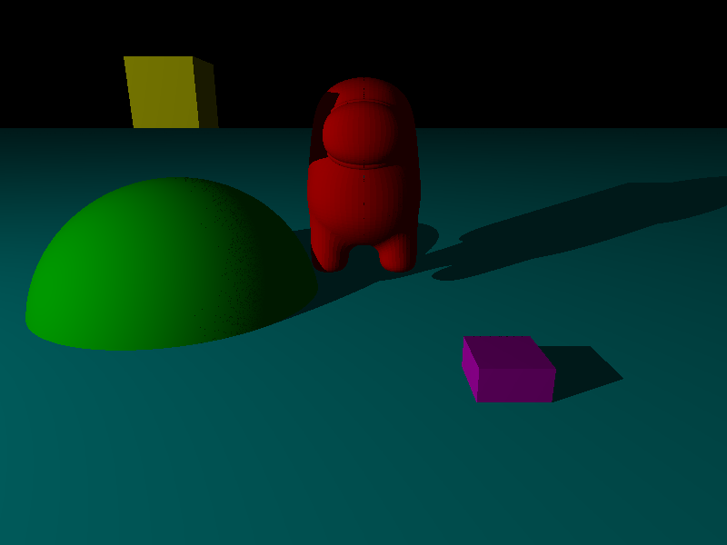

# raytracer-rust

A simple raytracer written in Rust. (Work in progress)

## Usage

```bash
cargo run
```


## Example render 




### Some sources I used for this project:

- HSLU RAYTRACING Course lectures and slides
- https://en.wikipedia.org/wiki/Monte_Carlo_method
- https://www.pbr-book.org/3ed-2018/Reflection_Models/Microfacet_Models
- https://assets.ctfassets.net/vyd75osjys97/5Vp4WpX9tux4HhGrjjTBVt/dff3035ab91f81e915eff912b4aac76d/Global_Illumination_compressed.pdf
- https://benedikt-bitterli.me/resources/
- https://github.com/tunabrain/tungsten
- https://en.wikipedia.org/wiki/Path_tracing
- https://en.wikipedia.org/wiki/Schlick's_approximation
- https://en.wikipedia.org/wiki/Lambertian_reflectance