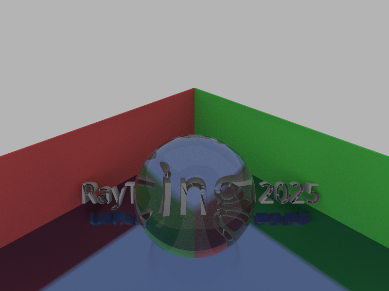
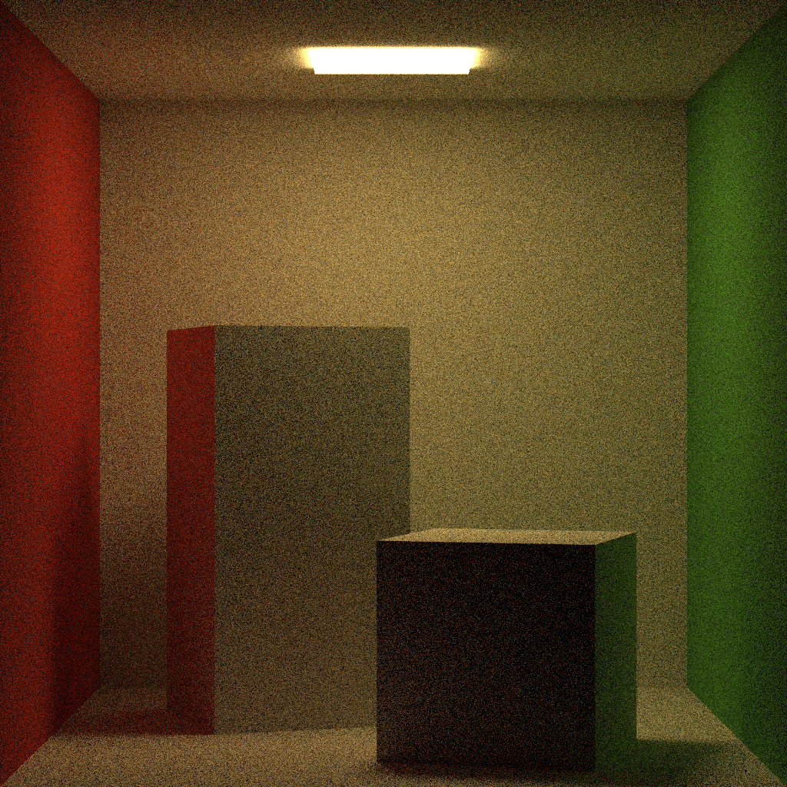
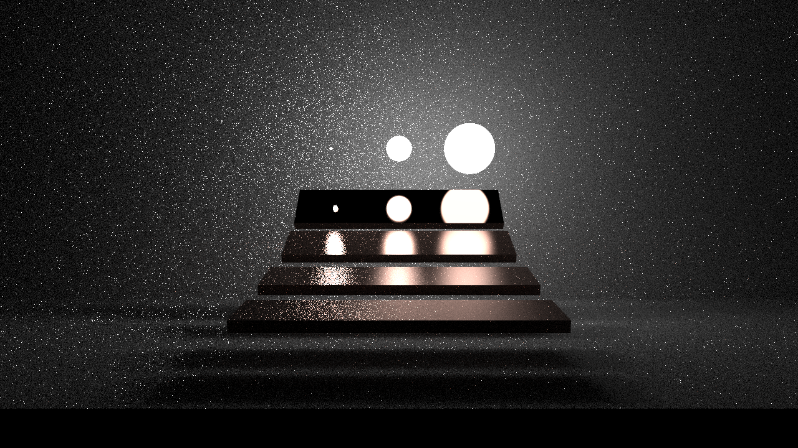

# raytracer-rust

A Monte Carlo path tracer written in Rust as a learning project for computer graphics.

## What I Built

### Core Features
- **Monte Carlo Path Tracing**: Physically-based light transport simulation
- **Multiple Material Types**: Lambertian, Metal, Dielectric (Glass), Rough Conductor, Plastic, Emissive
- **Geometry Support**: Spheres, Planes, Cubes, Quads, and Mesh loading (OBJ files work well, WO3 format is a bit wonky)
- **BVH Acceleration**: Fast ray-triangle intersection using Bounding Volume Hierarchies
- **Checker Textures**: Procedural checker patterns for materials
- **Microfacet Models**: GGX and Beckmann distributions for realistic metal surfaces
- **JSON Scene Format**: Partially compatible with Tungsten renderer scenes

### Performance
- **Parallel Rendering**: Multi-threaded rendering using Rayon
- **SIMD Optimizations**: Thanks to the `glam` library for vector math
- **Memory Efficiency**: Efficient data structures courtesy of Rust and the libraries used
- **Progress Tracking**: Real-time rendering progress with progress bars

## Usage

### Basic Usage
```bash
cargo run
```

### Scene Configuration
The raytracer uses JSON scene files (partially compatible with Tungsten renderer format). Example scenes are in `data/scenes/`:

```bash
# Render the semester project scene
cargo run  # Uses semesterbild.json by default

# Other example scenes available:
# - data/scenes/tungsten/cornell-box/scene.json
# - data/scenes/tungsten/veach-mis/scene.json
# - data/scenes/tungsten/teapot/scene.json
```

### Scene File Format
Scenes are defined in JSON format with support for:
- **BSDFs**: Material definitions (Lambertian, Metal, Glass, etc.)
- **Primitives**: Geometric objects (spheres, cubes, meshes, quads)
- **Camera**: Position, orientation, field of view, resolution
- **Renderer**: Sample count, output settings
- **Integrator**: Maximum ray bounces

Example scene structure:
```json
{
  "camera": {
    "transform": {
      "position": {"x": 220, "y": 200, "z": 220},
      "look_at": {"x": 36, "y": 30, "z": 36},
      "up": {"x": 0, "y": 1, "z": 0}
    },
    "fov": 60,
    "resolution": [800, 600]
  },
  "renderer": {
    "spp": 256
  },
  "integrator": {
    "max_bounces": 30
  }
}
```

### Output
- **Real-time Preview**: Interactive window showing render progress
- **PNG Export**: High-quality images saved to `render_images/` directory
- **Automatic Timestamping**: Files named with render date/time

## Example Renders

### Semester Project Scene


### Tungsten Scene Examples




## Building

### Prerequisites
- Rust 1.86+ (latest stable recommended)
- Cargo (included with Rust)

### Dependencies
- `glam`: Linear algebra and transformations (provides SIMD optimizations)
- `image`: Image loading and saving
- `rayon`: Parallel processing across CPU cores
- `rand`: Random number generation for Monte Carlo sampling
- `serde`: JSON parsing for scene files
- `indicatif`: Pretty progress bars during rendering
- `minifb`: Real-time display window
- `tobj`: OBJ file loading for 3D meshes

### Build Commands
```bash
# Debug build (faster compilation, slower execution)
cargo build

# Release build (optimized for performance)
cargo build --release

# Run with optimizations (recommended)
cargo run --release
```

## What I Learned

### Architecture
- **Ray Tracing Engine**: Monte Carlo path tracing with importance sampling
- **Acceleration Structures**: BVH for fast ray-geometry intersection
- **Material System**: Extensible BSDF framework with physical material models
- **Scene Management**: JSON-based scene description and loading

### Technical Implementation

#### Supported File Formats
- **Geometry**: OBJ (works well), WO3 (custom binary format, somewhat experimental)
- **Images**: Basic PNG output, some HDR skybox support (not thoroughly tested)
- **Scenes**: JSON configuration files (partially Tungsten renderer compatible)

#### Material Models
- **Lambertian**: Perfect diffuse reflection
- **Metal**: Conductor with configurable roughness and metal types (Cu, Au, Ag, Al, etc.)
- **Dielectric**: Glass/transparent materials with proper refraction
- **Plastic**: Layered model combining diffuse and specular components
- **Emissive**: Area lights with configurable intensity

#### Rendering Features
- **Monte Carlo Integration**: Unbiased light transport simulation
- **Importance Sampling**: Optimized sampling strategies for faster convergence
- **Fixed Ray Depth**: Path termination at maximum bounce count
- **Global Illumination**: Multiple scattering with indirect lighting

## Sources and References

This project was built while learning from:

- **HSLU RAYTRACING Course**: Lectures and slides on ray tracing fundamentals
- **Physically Based Rendering**: [PBR Book](https://www.pbr-book.org/3ed-2018/Reflection_Models/Microfacet_Models)
- **Tungsten Renderer**: [GitHub repo](https://github.com/tunabrain/tungsten/) and [Benedikt Bitterli's resources](https://benedikt-bitterli.me/resources/) for scene format inspiration
- **Academic References**:
  - [Monte Carlo Method](https://en.wikipedia.org/wiki/Monte_Carlo_method)
  - [Path Tracing](https://en.wikipedia.org/wiki/Path_tracing)
  - [Lambertian Reflectance](https://en.wikipedia.org/wiki/Lambertian_reflectance)
  - [Schlick's Approximation](https://en.wikipedia.org/wiki/Schlick's_approximation)

## Notes

This is an educational project developed as part of RAYTRACING coursework. Some features are experimental or not fully tested - it's been a great learning experience for understanding how path tracers work under the hood!